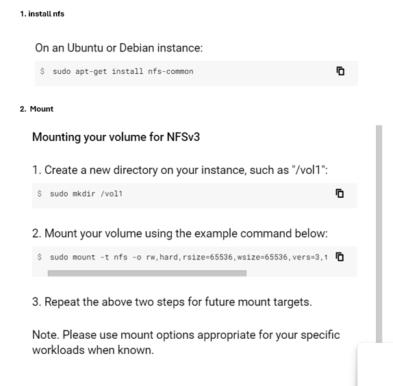
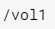
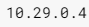

# Infrastructure as Code (IaC) and Manual Deployment of GCP Environment with NetApp Volumes using Terraform
This repository provides a comprehensive guide to automate the deployment and management of a Google Cloud Platform (GCP) environment that incorporates high-performance NetApp volumes. Leveraging Terraform's Infrastructure as Code (IaC) capabilities, this solution streamlines the provisioning process, ensuring consistency, scalability, and reproducibility.

# key Features 
- Seamless Infrastructure Provisioning: Easily create and configure essential GCP resources, including virtual machines (VMs), networks, storage buckets, and NetApp volumes.
- NetApp Integration: Leverage the power and performance of NetApp Cloud Volumes Service for your GCP workloads, ensuring data resilience and fast access.
- Terraform Automation: Define your infrastructure declaratively using Terraform configuration files, enabling efficient management and updates.
- Modularity and Reusability: The codebase is organized into modules, promoting reusability and maintainability across different projects.
- Detailed Documentation: This README provides step-by-step instructions, explanations, and best practices to guide you through the deployment process.

# Overview of Components
1. Provider Configuration
The provider configuration specifies the GCP project and region where the resources will be created. It is essential to ensure that the correct project ID and region are specified to avoid resource misplacement.

2. VPC Network
A Virtual Private Cloud (VPC) network provides an isolated network environment within GCP. The VPC network is configured with auto_create_subnetworks set to false to manually define subnets.

3. Public Subnets
Three public subnets are created within the VPC network. Each subnet is defined with its own IP CIDR range. The subnets facilitate the segmentation of the network into different address spaces.

4. Private Service Access
Private service access allows private connectivity between your VPC network and GCP services. A global address is reserved for the private service access range, and a service networking connection is created to enable the private connection. 

5. NetApp Storage Pool and Volume
A NetApp storage pool is created within the specified region and VPC network. This storage pool serves as the underlying storage for the NetApp volume. The NetApp volume is then created within this storage pool, with specific capacity and protocols (e.g., NFS).

6. Compute Instances
Two compute instances are created within the VPC network. These instances are assigned to one of the public subnets. Each instance is configured with a boot disk image and network interface.

7. Firewall Rule 1
Egress Rule for NFS
An egress firewall rule is created to allow outgoing NFS traffic from the compute instances to the NetApp volume. The rule specifies the allowed protocols and ports for NFS traffic.

8. Firewall Rule 2
Ingress Rule for NFS
An ingress firewall rule is created to allow incoming NFS traffic from the NetApp volume to the compute instances. This rule also specifies the allowed protocols and ports for NFS traffic.

## Prerequisites
- Google Cloud Platform (GCP) Account: You'll need an active GCP account with appropriate permissions to create and manage resources.
- Putty-keygen or any other keygen for adding ssh in VM instances
- Terraform Installation: Ensure you have Terraform installed on your local machine. Refer to the official Terraform documentation for installation instructions.
- GCP Project and Credentials: Set up your GCP credentials using one of the following methods:
- Application Default Credentials
- Service Account Key File
- Environment Variables

## STEPS:
1. Clone the repository to your local machine using the command `git clone https://github.com/ankushjha-aj/Terraform-CLOUD/tree/GCP 
2. Navigate to the cloned repository using the command `cd /path/to/cloned/repository`
3. Open PUTTYGEN App and Add Your Desired ssh-rsa key in metadata in both instance inside "main.tf" file so that you can have same username and SSH key for both instances. for e.g., 
- 
4. Adding the parameters will help you add an SSH-RSA key in your instances with the username of your choice.
5. Update "main.tf" according to your naming conventions as this is a single file without modules it will be easier for making updation.
6. Initialize Terraform using the command `terraform init` 
7. Plan Terraform using the command  `terraform plan`
8. Apply Terraform using the command `terraform apply`
9. Once the deployment is complete, you can verify the resources created in the GCP console.
10. The Outputs of "main.tf" will give you outputs like 
- 

- After the resources are created, go to the GCP Console.
- Navigate to NetApp > Volumes and find your volume.
- Follow the mount instructions to get the NetApp range IP.
- Edit the netapp-volume and `Add Rule` with instance Internal Ip tht you get after Creation of all your resources through terraform or you ca manually view your intstance internal IP like this, 
- 
- Update the destination_ranges in the "nfs_egress firewall" rule and the source_ranges in the "allow_nfs_to_instances" firewall rule with the NetApp range IP in `main.tf` terraform script for e.g., add `10.243.0.4/32` in place of `${google_compute_global_address.private_service_access_range.address}/32"`
- 

11. After updating the "main.tf" file, re-run the `terraform apply` command to update the firewall rules and NetApp volume settings.

# Mounting NetApp Volume (Manually) In your VM's

- Follow the instructions in the GCP Console `Netapp-volume Mount Instructions` to mount the NetApp volume to your instances.
- Make sure to update the firewall rules as mentioned above.
- You can use the following command to mount the NetApp volume to your instance:
- sudo mount -t nfs4 <NetApp_IP>:<volume_name> <mount_point> or 
- sudo mount -t nfs -o nolock,rw,hard,rsize=65536,wsize=65536,vers=3,tcp <NetApp_IP>:<volume_name> <mount_point>
- Replace <NetApp_IP> with the IP of your NetApp volume, <volume_name> with the name of your NetApp volume, and <mount_point> with the desired mount point on your instance.
- 

## Automation process
1. How to update (https://github.com/ankushjha-aj/Terraform-CLOUD/blob/GCP/.github/workflows/netApp.yml)
- secrets: (Add This in your Github Action SAecrets)
     - GCP_VM_1_IP: ${{ secrets.GCP_VM_1_IP }} # Enter Your VM-1 IP
     - GCP_USER: ${{ secrets.GCP_USER }}       # Enter Your username
     - GCP_SSH_KEY: ${{ secrets.GCP_SSH_KEY }} # Enter Your private Key that you get from Putty (OPENSSH)
     - GCP_VM_2_IP: ${{ secrets.GCP_VM_2_IP }} # Enter Your VM-2 IP
- with:
     - VOL_NAME: /vol1        # change your desired Vol Name 
     - 
     - NETAPP_IP: 10.29.0.4   # change you netapp vol IP
     - 
     - DIR_NAME: NetApp-7     # change you Desired Dir Name taht you want to create inside your Net-App Volume

- By Updating These Variables With your Desired Values will Automatically SSH into your VM's and Mount the `NetApp-Volume` that we created as this Workflow is being calling 
- `https://github.com/ankushjha-aj/Terraform-CLOUD/blob/GCP/.github/workflows/netApp_volume_reusable.yml`

# Summary
- This README.md file includes detailed steps for setting up the infrastructure, explanations of each resource, and instructions for updating and using the created resources. By following these steps, you will be able to successfully deploy and manage a GCP environment with NetApp volumes using Terraform and GitHub Actions.

# Additional Notes
- Version Control: Use Git or a similar system to track changes to your Terraform code.
- State Management: Consider using remote state storage (e.g., in a GCP bucket) for better collaboration and state management. (for storing tfstate files) 
- Security Best Practices: Apply appropriate security measures to your GCP resources and NetApp volumes.

 